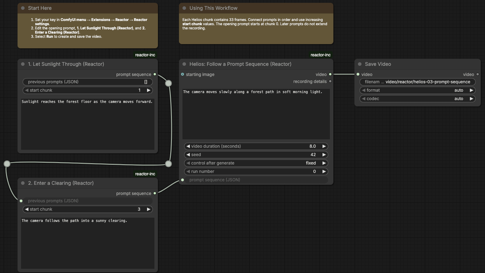
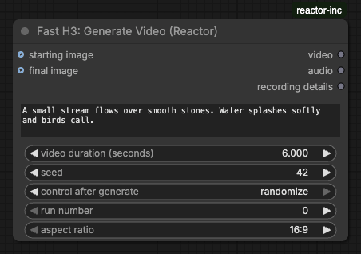

# 

[](#requirements)
[](#requirements)
[](#requirements)
[](LICENSE.md)

Generate videos, edit local clips, and move through scenes with Reactor models
in ComfyUI. Models run on Reactor; no model weights are downloaded.

## Contents

- [Requirements](#requirements)
- [Install](#install)
- [Make your first video](#make-your-first-video)
- [Choose a workflow](#choose-a-workflow)
- [Nodes](#nodes)
- [Find and refresh models](#find-and-refresh-models)
- [Fix a setup problem](#fix-a-setup-problem)

## Requirements

- Python 3.12 or later.
- ComfyUI 0.34.6 or later, with frontend 1.49.6 or later in the 1.x series.
- A Reactor account with credits.

## Install

The connector includes its built browser assets. You do not need Bun, mise, or
development dependencies to use it.

1. Stop ComfyUI after active work finishes.
2. Place the connector at `ComfyUI/custom_nodes/reactor-inc`. Put `__init__.py`
   and `requirements.txt` directly inside that folder.
3. Install `requirements.txt` using the Python environment that runs ComfyUI.
   Choose the command below for your installation.
4. Start ComfyUI, then refresh its window.

### Comfy Desktop

1. On the home screen, open the installation's **⋮** menu and select **Manage**.
2. Open **About** and copy **Location** to find the installation folder. Inside it,
   find the `ComfyUI` folder containing `main.py` and place the connector at
   `custom_nodes/reactor-inc`.
3. Open **Terminal** in the same Manage panel. Desktop opens the ComfyUI folder
   and activates that installation's Python environment. Run:

```sh
pip install -r custom_nodes/reactor-inc/requirements.txt
```

Start the installation after the command finishes. See
[Comfy Desktop's Manage panel](https://docs.comfy.org/installation/desktop/usage/manage)
for the folder and terminal controls.

### Manual installation: macOS or Linux

Run from the ComfyUI directory. Replace `.venv` if your environment has another name:

```sh
.venv/bin/python -m pip install -r custom_nodes/reactor-inc/requirements.txt
```

For a uv environment without pip, use:

```sh
uv pip install --python .venv/bin/python -r custom_nodes/reactor-inc/requirements.txt
```

### Manual installation: Windows

Run in PowerShell from the ComfyUI directory. Replace `.venv` if your virtual
environment has another name or location:

```powershell
.\.venv\Scripts\python.exe -m pip install -r .\custom_nodes\reactor-inc\requirements.txt
```

### Windows portable

Run in PowerShell from the folder containing `ComfyUI` and `python_embeded`:

```powershell
.\python_embeded\python.exe -m pip install -r .\ComfyUI\custom_nodes\reactor-inc\requirements.txt
```

See [update or remove](ADVANCED.md#update-or-remove) for later
package changes. Install only runtime requirements into ComfyUI's environment.

## Make your first video

1. Select the Comfy logo, then **Extensions → Reactor → Reactor settings**.
   Save your Reactor API key there. It stays on the server and out of workflows.
2. Open native **Browse Templates → reactor-inc** and select
   **helios-01-text-to-video**. You can also drag the
   [Helios text-to-video workflow](example_workflows/helios-01-text-to-video.json)
   onto the canvas.
3. Read **Start Here**, describe a scene, and choose the video length.
4. Select **Run**.
5. Play the result in **Save Video**. It also saves the file under
   ComfyUI's output folder.

Use ComfyUI's cancel control to stop a run. Closing a workflow tab does not cancel
it. Change **run number** to request another run with unchanged inputs.

## Choose a workflow

The `example_workflows` folder holds 33 editable graphs. Open one from native
**Browse Templates → reactor-inc**, or drag its JSON file onto ComfyUI. Each graph
has connected nodes and a **Start Here** note. Examples need only native ComfyUI
nodes and this connector. Media inputs start empty; select your own image or
video, or use a [sample input](#sample-inputs).

Use live workflows for scene prompts, Visko sound prompts, X2 dragging, or SANA
and X2 webcams. LingBot workflows with scene controls let you move with keys or buttons;
saved video cannot reopen a world. Fast H3 can continue a chosen number of clips
in one run. See [live controls](ADVANCED.md#live-controls).



After updating, open an example in a new tab. Existing graphs keep their saved
notes, prompts, and layout. Notes and node titles are saved in the graph in
English; changing the interface language does not translate them.

### Fast H3

| Workflow JSON                                                                                      | Input                                | Guide                                            |
| -------------------------------------------------------------------------------------------------- | ------------------------------------ | ------------------------------------------------ |
| [Fast H3: Generate a Clip with Audio](example_workflows/fast-h3-01-text-to-video.json)             | Scene and sound prompt               | [Node guide](web/docs/ReactorIncFastGenerate.md) |
| [Fast H3: Animate an Image](example_workflows/fast-h3-02-image-to-video.json)                      | Image and prompt                     | [Node guide](web/docs/ReactorIncFastGenerate.md) |
| [Fast H3: Connect Two Images with Motion](example_workflows/fast-h3-03-first-and-last-frames.json) | First image, final image, and prompt | [Node guide](web/docs/ReactorIncFastGenerate.md) |
| [Fast H3: Finish on a Chosen Image](example_workflows/fast-h3-04-ending-frame.json)                | Final image and prompt               | [Node guide](web/docs/ReactorIncFastGenerate.md) |
| [Fast H3: Continue a Scene](example_workflows/fast-h3-05-continue-scene.json)                      | Prompts for continued clips          | [Node guide](web/docs/ReactorIncFastContinue.md) |
| [Fast H3: Continue from an Image](example_workflows/fast-h3-06-continue-image.json)                | Starting image and continued clips   | [Node guide](web/docs/ReactorIncFastContinue.md) |

### Helios

| Workflow JSON                                                                                      | Input                                | Guide                                              |
| -------------------------------------------------------------------------------------------------- | ------------------------------------ | -------------------------------------------------- |
| [Helios: Generate Video](example_workflows/helios-01-text-to-video.json)                           | Scene prompt                         | [Node guide](web/docs/ReactorIncHeliosGenerate.md) |
| [Helios: Animate an Image](example_workflows/helios-02-image-to-video.json)                        | Image and prompt                     | [Node guide](web/docs/ReactorIncHeliosAnimate.md)  |
| [Helios: Follow a Prompt Sequence](example_workflows/helios-03-prompt-sequence.json)               | Scheduled prompts                    | [Node guide](web/docs/ReactorIncHeliosSequence.md) |
| [Helios: Animate an Image with a Prompt Sequence](example_workflows/helios-04-image-sequence.json) | Starting image and scheduled prompts | [Node guide](web/docs/ReactorIncHeliosSequence.md) |
| [Helios: Change the Prompt While Recording](example_workflows/helios-05-live-prompt.json)          | Live prompt                          | [Node guide](web/docs/ReactorIncHeliosGenerate.md) |
| [Helios: Animate an Image with Live Prompts](example_workflows/helios-06-live-image.json)          | Image and live prompt                | [Node guide](web/docs/ReactorIncHeliosAnimate.md)  |

### LingBot

| Workflow JSON                                                                                 | Input                                  | Guide                                              |
| --------------------------------------------------------------------------------------------- | -------------------------------------- | -------------------------------------------------- |
| [LingBot: Explore an Image](example_workflows/lingbot-01-explore-image.json)                  | Image and prompt                       | [Node guide](web/docs/ReactorIncLingBotExplore.md) |
| [LingBot: Explore an Image with Live Controls](example_workflows/lingbot-02-live-camera.json) | Image and prompt; live keys or buttons | [Node guide](web/docs/ReactorIncLingBotExplore.md) |

### LingBot World 2

| Workflow JSON                                                                                                 | Input                                  | Guide                                                    |
| ------------------------------------------------------------------------------------------------------------- | -------------------------------------- | -------------------------------------------------------- |
| [LingBot World 2: Explore an Image](example_workflows/lingbot-world-2-01-explore-image.json)                  | Image and prompt                       | [Node guide](web/docs/ReactorIncLingBotWorld2Explore.md) |
| [LingBot World 2: Explore an Image with Live Controls](example_workflows/lingbot-world-2-02-live-camera.json) | Image and prompt; live keys or buttons | [Node guide](web/docs/ReactorIncLingBotWorld2Explore.md) |

### LongLive

| Workflow JSON                                                                                      | Input                                  | Guide                                                  |
| -------------------------------------------------------------------------------------------------- | -------------------------------------- | ------------------------------------------------------ |
| [LongLive: Generate Video](example_workflows/longlive-v2-01-text-to-video.json)                    | Scene prompt                           | [Node guide](web/docs/ReactorIncLongLiveGenerate.md)   |
| [LongLive: Generate Video with Shot Transitions](example_workflows/longlive-v2-02-storyboard.json) | Opening prompt and two scheduled shots | [Node guide](web/docs/ReactorIncLongLiveStoryboard.md) |
| [LongLive: Change the Prompt While Recording](example_workflows/longlive-v2-03-live-prompt.json)   | Live prompt                            | [Node guide](web/docs/ReactorIncLongLiveGenerate.md)   |

### LTX

| Workflow JSON                                                                  | Input                      | Guide                                        |
| ------------------------------------------------------------------------------ | -------------------------- | -------------------------------------------- |
| [LTX: Make a Portrait Speak](example_workflows/ltx2-01-speaking-portrait.json) | Portrait and speech script | [Node guide](web/docs/ReactorIncLtxSpeak.md) |

### SANA

| Workflow JSON                                                                                   | Input                          | Guide                                             |
| ----------------------------------------------------------------------------------------------- | ------------------------------ | ------------------------------------------------- |
| [SANA: Edit Video](example_workflows/sana-streaming-01-edit-video.json)                         | Video and edit prompt          | [Node guide](web/docs/ReactorIncSanaEditVideo.md) |
| [SANA: Change the Prompt While Recording](example_workflows/sana-streaming-02-live-prompt.json) | Source video and live controls | [Node guide](web/docs/ReactorIncSanaEditVideo.md) |
| [SANA: Edit Webcam Video](example_workflows/sana-streaming-03-webcam.json)                      | Webcam and live edit prompt    | [Node guide](web/docs/ReactorIncSanaWebcam.md)    |

### Visko Dynamic

| Workflow JSON                                                                                           | Input                  | Guide                                                    |
| ------------------------------------------------------------------------------------------------------- | ---------------------- | -------------------------------------------------------- |
| [Visko Dynamic: Generate Video with Audio](example_workflows/visko-dynamic-01-text-to-video.json)       | Scene and sound prompt | [Node guide](web/docs/ReactorIncViskoDynamicGenerate.md) |
| [Visko Dynamic: Animate an Image with Audio](example_workflows/visko-dynamic-02-image-to-video.json)    | Image and prompt       | [Node guide](web/docs/ReactorIncViskoDynamicGenerate.md) |
| [Visko Dynamic: Change the Prompt While Recording](example_workflows/visko-dynamic-03-live-prompt.json) | Live prompt            | [Node guide](web/docs/ReactorIncViskoDynamicGenerate.md) |

### Visko Stable

| Workflow JSON                                                                                         | Input                  | Guide                                                   |
| ----------------------------------------------------------------------------------------------------- | ---------------------- | ------------------------------------------------------- |
| [Visko Stable: Generate Video with Audio](example_workflows/visko-stable-01-text-to-video.json)       | Scene and sound prompt | [Node guide](web/docs/ReactorIncViskoStableGenerate.md) |
| [Visko Stable: Animate an Image with Audio](example_workflows/visko-stable-02-image-to-video.json)    | Image and prompt       | [Node guide](web/docs/ReactorIncViskoStableGenerate.md) |
| [Visko Stable: Change the Prompt While Recording](example_workflows/visko-stable-03-live-prompt.json) | Live prompt            | [Node guide](web/docs/ReactorIncViskoStableGenerate.md) |

### X2

| Workflow JSON                                                                      | Input                                   | Guide                                           |
| ---------------------------------------------------------------------------------- | --------------------------------------- | ----------------------------------------------- |
| [X2: Edit Video](example_workflows/x2-01-edit-video.json)                          | Video and edit prompt                   | [Node guide](web/docs/ReactorIncX2EditVideo.md) |
| [X2: Edit with a Reference Image](example_workflows/x2-02-reference-edit.json)     | Video, edit prompt, and reference image | [Node guide](web/docs/ReactorIncX2EditVideo.md) |
| [X2: Edit Webcam Video with Pointer Controls](example_workflows/x2-03-webcam.json) | Webcam and live edit prompt             | [Node guide](web/docs/ReactorIncX2Webcam.md)    |
| [X2: Drag and Edit a Video](example_workflows/x2-04-live-prompt.json)              | Source video and live controls          | [Node guide](web/docs/ReactorIncX2EditVideo.md) |

### Sample inputs

Download a sample, then select it in the matching image or video input node.

| File                                                                    | Use it for                                             |
| ----------------------------------------------------------------------- | ------------------------------------------------------ |
| [Forest path](example_workflows/assets/forest-path.png)                 | Animate an image, explore a scene, or continue a clip. |
| [Forest illustration](example_workflows/assets/forest-illustration.png) | Animate a landscape or use it as a reference image.    |
| [Fictional portrait](example_workflows/assets/fictional-portrait.png)   | Make a portrait speak with LTX.                        |
| [Forest motion](example_workflows/assets/forest-motion.mp4)             | Edit a five-second clip with SANA or X2.               |

The sample images are generated illustrations. The portrait depicts a fictional
adult. The sample video adds a slow zoom to the forest image: 120 frames at
24 fps, 640 × 360 pixels, standard dynamic range, and no sound. They are inputs,
not examples of Reactor output.

### Workflow previews

These images show frames from Reactor output. Your results can differ.

| Preview                                                             | Workflow                                                                               |
| ------------------------------------------------------------------- | -------------------------------------------------------------------------------------- |
| [Stream over rocks](example_workflows/fast-h3-01-text-to-video.jpg) | [Fast H3: Generate a Clip with Audio](example_workflows/fast-h3-01-text-to-video.json) |
| [Animated forest](example_workflows/helios-02-image-to-video.jpg)   | [Helios: Animate an Image](example_workflows/helios-02-image-to-video.json)            |

Project rights in the samples and previews are licensed under [MIT](LICENSE.md).

## Nodes


| Node                                                                                             | Input                                                     | Output                            |
| ------------------------------------------------------------------------------------------------ | --------------------------------------------------------- | --------------------------------- |
| [Fast H3: Generate Video (Reactor)](web/docs/ReactorIncFastGenerate.md)                          | Scene and sound prompt, optional first and last images    | Video with sound, separate audio  |
| [Fast H3: Continue a Scene (Reactor)](web/docs/ReactorIncFastContinue.md)                        | Clip count, prompts, and optional starting image          | Video with sound, separate audio  |
| [Helios: Generate Video (Reactor)](web/docs/ReactorIncHeliosGenerate.md)                         | Prompt                                                    | Video without sound               |
| [Helios: Animate an Image (Reactor)](web/docs/ReactorIncHeliosAnimate.md)                        | One image and a prompt                                    | Video without sound               |
| [Helios: Add a Prompt (Reactor)](web/docs/ReactorIncHeliosAddPrompt.md)                          | Chunk number, prompt, and optional earlier prompts        | A prompt sequence                 |
| [Helios: Generate Video from a Prompt Sequence (Reactor)](web/docs/ReactorIncHeliosSequence.md)  | Opening prompt, scheduled changes, and optional image     | Video without sound               |
| [LingBot: Explore an Image (Reactor)](web/docs/ReactorIncLingBotExplore.md)                      | Image, prompt, and camera directions                      | Video without sound               |
| [LingBot World 2: Explore an Image (Reactor)](web/docs/ReactorIncLingBotWorld2Explore.md)        | Image, prompt, and camera directions                      | Video without sound               |
| [LongLive: Generate Video (Reactor)](web/docs/ReactorIncLongLiveGenerate.md)                     | Opening shot prompt                                       | Video without sound               |
| [LongLive: Add a Shot (Reactor)](web/docs/ReactorIncLongLiveAddShot.md)                          | Shot prompt, transition, and chunk number                 | A storyboard                      |
| [LongLive: Generate Video from a Storyboard (Reactor)](web/docs/ReactorIncLongLiveStoryboard.md) | Opening prompt and scheduled shots                        | Video without sound               |
| [LTX: Make a Portrait Speak (Reactor)](web/docs/ReactorIncLtxSpeak.md)                           | Portrait, script, and speech pace                         | Video with speech, separate audio |
| [SANA: Edit Video (Reactor)](web/docs/ReactorIncSanaEditVideo.md)                                | Local video and edit prompt                               | Video without sound               |
| [SANA: Edit Webcam Video (Reactor)](web/docs/ReactorIncSanaWebcam.md)                            | Camera and live edit prompt                               | Video without sound               |
| [Visko Stable: Generate Video (Reactor)](web/docs/ReactorIncViskoStableGenerate.md)              | Scene prompt, sound controls, and optional image          | Video with sound, separate audio  |
| [Visko Dynamic: Generate Video (Reactor)](web/docs/ReactorIncViskoDynamicGenerate.md)            | Scene prompt, sound controls, and optional image          | Video with sound, separate audio  |
| [X2: Edit Video (Reactor)](web/docs/ReactorIncX2EditVideo.md)                                    | Local video, edit prompt, and optional reference image    | Video without sound               |
| [X2: Edit Webcam Video (Reactor)](web/docs/ReactorIncX2Webcam.md)                                | Camera, optional subject image, live prompt, and dragging | Video without sound               |

Select a Reactor node and open its native **Info** for inputs, limits, and
examples. Nodes with detailed behavior show their bundled guide there.



In your own graph, connect **video** to **Save Video**. Models with sound also
return a separate **audio** output. Generation nodes also return [Recording details](ADVANCED.md#recording-details),
which describes the saved file and its model. Prompt and shot builders work
locally without contacting Reactor. HappyOyster is not supported.

## Find and refresh models

Models supported by the installed nodes appear before the first refresh.
Refresh the list to load public prices and guides.

Open **Extensions → Reactor → Reactor models** to search the list and select
**Refresh Models** for the latest public prices and guides.

**Refreshing the list does not install new nodes.** A model can run only when the
connector includes code and nodes that support it. Entries show whether nodes
are available. Your Reactor account determines access to each provider model.

Reactor settings can enable automatic checks. They report changes; select
**Refresh Models** to save the updated list. See [model updates](ADVANCED.md#model-updates)
for how checks work and how to restore a previous list.

## Fix a setup problem

| Problem                                      | What to check                                                                                  |
| -------------------------------------------- | ---------------------------------------------------------------------------------------------- |
| Reactor nodes are missing                    | Confirm the running instance has `custom_nodes/reactor-inc/__init__.py`; read its startup log. |
| `reactor_sdk` cannot be imported             | Install runtime requirements with that instance's Python.                                      |
| No matching SDK distribution                 | Use Python 3.12 or later and a platform supported by the required SDK version.                 |
| `comfy_api` or a native node type is missing | Update ComfyUI through its normal update procedure, then restart.                              |
| Nodes appear but Reactor menus do not        | Refresh the window; confirm the package includes `web/extension.js` and `web/extension.css`.   |
| Node help is missing                         | Restore the complete package, including the native guides under `web/docs`.                    |
| Templates are missing                        | Confirm the package includes `example_workflows`; you can also open a JSON file there.         |
| Duplicate nodes or menus appear              | Keep one connector folder; move backups outside `custom_nodes`.                                |
| Private settings are disabled                | Use a local, single-user connection. For remote access, set the server environment key.        |

For rejected inputs, timeouts, or session errors, read [recovery](ADVANCED.md#recovery)
and the node's native **Info** before another run. [Advanced settings](ADVANCED.md)
explains keys, limits, credit calculations, and live controls.

Project-authored code, guides, workflows, and sample assets use the
[MIT license](LICENSE.md). Third-party components keep their own license terms.
